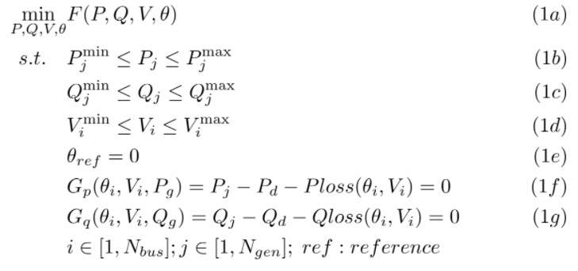
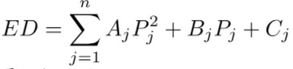
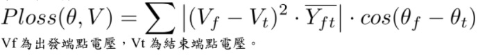
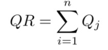
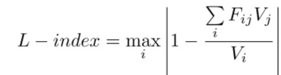

# Optimal-Power-Flow

IEEE- standard bus optimal power flow analysis. 

This is optimization question.

Based on [Matpower](https://matpower.org/)

Question:

(1a) :target function

(1b) :generator active power limit.

(1c) :generator reactive power limits.

(1d) :bus voltage limits.

(1e) :swing bus angle = 0.

(1f) :active power euqation.

(1g) :reactive power euqation.

Target 

1. Economics dispatch

2. Power loss

3. Reactive power preserve

4. L-index

